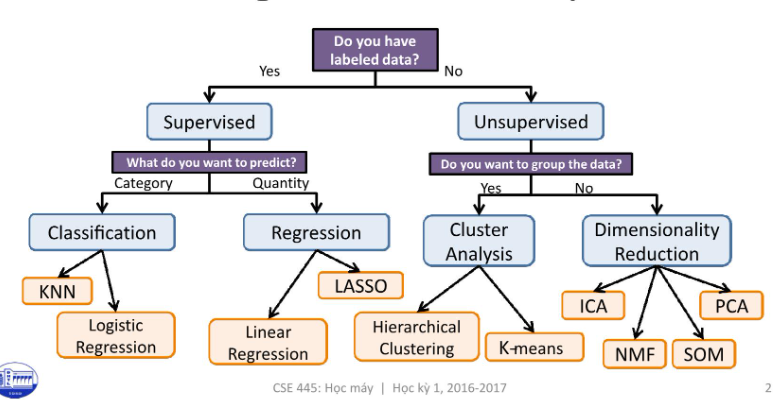
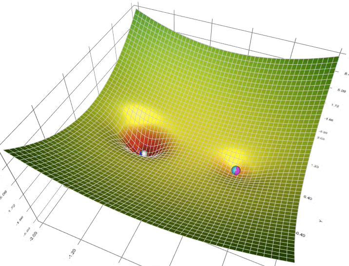
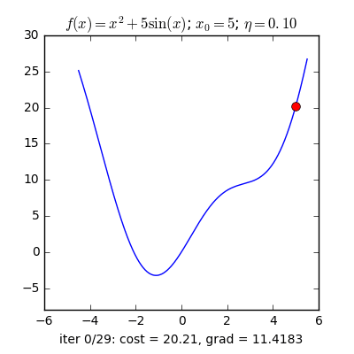

# final_ML_personal
Nguyễn Thị Thu Hồng - 52100962

# DỰ ÁN CUỐI KỲ
# NHẬP MÔN HỌC MÁY
BÀI 1: Trình bày một bài nghiên cứu, đánh giá của em về các vấn đề sau:
1.	Tìm hiểu, so sánh các phương pháp Optimizer trong huấn luyện mô hình học máy;
2.	Tìm hiểu về Continual Learning và Test Production khi xây dựng một giải pháp học máy để giải quyết một bài toán nào đó;

## CHƯƠNG 1 – TỔNG QUAN VỀ HỌC MÁY
### 1.1 Học máy là gì?
Machine learning (học máy hay máy học) là một nhánh con của trí tuệ nhân tạo (AI) và khoa học máy tính. Machine learning sử dụng dữ liệu, thuật toán đầu vào để tự xử lý các vấn đề và liên tục tối ưu để tạo ra những phương án xử lý mới hiệu quả hơn, phù hợp hơn, giống như cách thức tự học của não bộ con người.

Một cách tổng quát, trong cuốn sách Machine Learning của tác giả Tom Mitchell xuất bản năm 1997, học máy được định nghĩa như sau: “A computer program is said to learn to perform a task T from experience E, if its performance at task T, as measured by a performance metric P, improves with experience E over time” (Một chương trình máy tính được cho là học để thực hiện một nhiệm vụ T từ kinh nghiệm E, nếu hiệu suất thực hiện công việc T của nó được đo bởi chỉ số hiệu suất P và được cải thiện bởi kinh nghiệm E theo thời gian).
Khác biệt giữa chương trình lập trình truyền thống và học máy.


Hình 1.1 Minh họa chương trình lập trình truyền thống


Hình 1.1 Minh họa học máy

Thống kê và dự đoán là hai mục đích chính của việc áp dụng machine learning vì thế hệ thống này được thiết kế với khả năng tự nghiên cứu, cải tiến bản thân dựa trên những nguyên lý được lập trình ban đầu. Trong nhiều trường hợp machine learning sẽ tự đề xuất ra giải pháp tối ưu mà không cần được lập trình trước. Do đó, có thể nói Machine Learning giống như một người lao động với khả năng tự học, hoàn thiện và giàu kinh nghiệm hơn theo thời gian.

Trong những năm gần đây, khi mà khả năng tính toán của các máy tính được nâng lên một tầm cao mới và lượng dữ liệu khổng lồ được thu thập bởi các hãng công nghệ lớn, Machine Learning đã tiến thêm một bước dài và một lĩnh vực mới được ra đời gọi là Deep Learning (Học Sâu). Deep Learning đã giúp máy tính thực thi những việc tưởng chừng như không thể vào 10 năm trước: phân loại cả ngàn vật thể khác nhau trong các bức ảnh, tự tạo chú thích cho ảnh, bắt chước giọng nói và chữ viết của con người, giao tiếp với con người, hay thậm chí cả sáng tác văn hay âm nhạc, …


Hình 1.2 Mối quan hệ giữa AI, Machine Learning và Deep Learning

(Nguồn: What’s the Difference Between Artificial Intelligence, Machine Learning, and Deep Learning?)

### 1.2 Phân loại Học máy:

Dựa trên các tiêu chí khác nhau, người ta có thể phân loại các thuật toán Học máy theo nhiều cách khác nhau. 

#### 1.2.1 Phân loại theo vấn đề, nhiệm vụ cần giải quyết:

Dựa vào vấn đề, nhiệm vụ cần giải quyết của thuật toán, người ta phân loại các thuật toán Học máy thành ba loại:

1.	Hồi quy (Regression): Giải quyết bài toán dự đoán giá trị một đại lượng nào đó dựa vào giá trị của các đại lượng liên quan. Ví dụ, dựa vào các đặc điểm như diện tích, số phòng, khoảng cách tới trung tâm…để dự đoán giá trị căn nhà.
2.	Phân lớp (Classification): Giải quyết các bài toán nhận dạng xem một đối tượng thuộc lớp nào trong số các lớp cho trước. Ví dụ, bài toán nhận diện chữ viết, bài toán phân loại email…thuộc các thuật toán phân lớp.
3.	Phân cụm (Clustering): Ý tưởng cơ bản giống với các thuật toán phân lớp, sự khác biệt là ở chỗ, trong các bài toán phân cụm, các cụm chưa được xác định trước và thuật toán phải tự khám phá và phân cụm dữ liệu.



Hình 1.3 Các giải thuật Học máy

(Nguồn: https://tailieuhay.vn/tai-lieu/bai-giang-hoc-may-bai-5-cay-phan-loai-va-hoi-quy-nguyen-thanh-tung-7733/ )

#### 1.2.2 Phân loại theo cách máy tính học:

Dựa trên cách máy tính học, người ta chia các thuật toán Học máy thành ba loại:

1.	Học tập dưới sự giám sát (Supervised learning): Con người sẽ lập trình dữ liệu đầu vào bao gồm cả cách thức và phương án mà con người mong muốn. Phương án và đáp án sẽ được gắn nhãn, sắp xếp sẵn và Machine Learning chỉ cần rà soát và trả ra đúng kết quả có trong bộ dữ liệu đã có. Tin nhắn rác đến từ 1 số nguồn sẽ tự động được tách ra khỏi hộp thư chính là ứng dụng của machine learning giúp phân loại tin nhắn trên email.
2.	Học tập mà không giám sát (Unsupervised learning): Machine learning chỉ được cung cấp các thuật toán, công cụ để tự xử lý mà không biết trước kết quả. Dễ thấy nhất việc ứng dụng của phân loại này đó là cá nhân hóa trải nghiệm khách hàng.Dữ liệu đầu vào bao gồm hành vi, lịch sử mua mua hàng và hệ thống sẽ dự đoán những sản phẩm phù hợp và đề xuất riêng cho từng khách hàng.
3.	Học tập được giám sát bán phần (Semi-supervised learning): Đây là phân loại nằm ở giữa của 2 phân loại trên khi này dữ liệu đầu vào là 1 hỗn hợp bao gồm cả phương pháp lẫn đáp án. Điểm khác biệt ở đây là phương án và đáp án chưa được nhóm lại thành từng bộ. Như vậy machine learning phải tự tìm ra cách giải nào tương thích với đáp án nào trong bộ dữ liệu sẵn có.

### 1.3 Các bước cơ bản thực hiện một thuật toán Học máy:

Nhìn chung, việc thực hiện một thuật toán Học máy thường trải qua các bước cơ bản sau:

1.	Thu thập dữ liệu – Gathering data/Data collection
2.	Tiền xử lý dữ liệu – Data preprocessing
    1.	Trích xuất dữ liệu – data extraction
    2.	Làm sạch dữ liệu – data cleaning
    3.	Chuyển đổi dữ liệu – Data transformation
    4.	Chuẩn hóa dữ liệu – Data normalization
    5.	Trích xuất đặc trưng – Feature extraction
3.	Phân tích dữ liệu – Data analysis
4.	Xây dựng mô hình máy học – Model building
5.	Huấn luyện mô hình – Model training
6.	Đánh giá mô hình – Model evaluation
   
Trong tất cả các bước thì việc thu thập dữ liệu, tiền xử lý và xây dựng bộ dữ liệu là tốn nhiều thời gian và công sức nhất. Đây là bước quan trọng, có ảnh hưởng rất nhiều đến hiệu quả của thuật toán Học máy.

### 1.4 Ứng dụng của Học máy:

Ứng dụng tổng quát:

•	Xử lý ảnh
•	Phân tích văn bản
•	Khai phá dữ liệu

Ứng dụng trong thực tế:

•	Giải mã thị trường tài chính

•	Thay đổi cục diện ngành nông nghiệp

•	Nâng cao hiệu quả và cải thiện chất lượng dịch vụ ngành y tế

•	Cơ quan nhà nước có thể quản lý trật tự xã hội và đảm bảo tình hình phát triển đất nước

## CHƯƠNG 2 – CÁC PHƯƠNG PHÁP OPTIMIZER
### 2.1 Tổng quan về Optimizer
#### 2.1.1 Optimizer là gì?
Optimizer hay Thuật toán tối ưu là cơ sở để xây dựng mô hình Neural Network với mục đích “học” được các feature (hay pattern) của dữ liệu đầu vào, để từ đó có thể tìm một tập các trọng số (weights – w) và ngưỡng (bias – b) phù hợp hơn để tối ưu hóa mô hình. 

Và có thể nói các thuật toán tối ưu (Optimizition Algorithm) là một trong những “hạt nhân” mạnh mẽ của hầu hết thuật toán Machine Learning. Đây một quy trình được thực hiện lặp đi lặp lại bằng cách so sánh các giải pháp khác nhau cho đến khi tìm thấy một giải pháp tối ưu hoặc thỏa đáng.

Đối với kỹ thuật học sâu nói riêng, thuật toán tối ưu là các kỹ thuật giúp xây dựng các mô hình mạng nơ-ron để tối ưu hóa độ chính xác của mô hình mạng.



Hình 2.1 Minh họa thuật toán tối ưu (Optimizer)

#### 2.1.2 Vai trò của thuật toán tối ưu

Trong thuật toán học máy nói chung và kỹ thuật học sâu nói riêng, thuật toán tối ưu hóa (Optimizer) là một khâu quan trọng không thể thiếu. Quá trình tối ưu hóa thực hiện xác định hàm mất mát (loss function) và sau đó tối thiểu hóa hàm trên bằng cách sử dụng hàm tối ưu. Cụ thể, thông qua việc cập nhật các tham số của mô hình (w, b) và đánh giá lại hàm mất mát với một tỉ lệ học (learning rate) xác định, quá trình tối ưu giúp mô hình tương thích tốt hơn với tập dữ liệu được đào tạo.

##### 2.1.2.1 Hàm mất mát (Loss function)

Hàm mất mát (Loss function) là một phương pháp đánh giá độ hiệu quả của thuật toán “học” cho mô hình trên tập dữ liệu được sử dụng. 
Hàm mất mát trả về một số thực không âm thể hiện sự chênh lệch giữa hai đại lượng: 

•	a: nhãn được dự đoán

•	y: nhãn đúng

Bản thân hàm mất mát chính là một cơ chế thưởng-phạt, mô hình sẽ phải đóng phạt mỗi lần dự đoán sai và mức phạt tỉ lệ thuận với độ lớn sai sót. 
Trong mọi bài toán học có giám sát, mục tiêu luôn bao gồm giảm tổng mức phạt phải đóng. Trong trường hợp lý tưởng a = y, hàm mất mát sẽ trả về giá trị cực tiểu bằng 0. 
Hai hàm mất mát thường xuyên được sử dụng trong mạng nơ-ron: 

•	MSE (Mean Squared Error)

•	Cross Entropy

##### 2.1.2.2 Tỉ lệ học (Learning rate)

Learning rate hay tỉ lệ học là một thông số quan trọng trong việc quyết định tốc độ học của mạng nơ-ron. Tốc độ học được thể hiện bằng sự thay đổi giá trị cập nhật trọng số (weights - w) trong các chu kỳ học. Tùy theo mục đích của mô hình mà tăng/ giảm tỉ lệ học. 

Tỉ lệ học càng cao thì giúp mô hình học khá nhanh và tiết kiệm được thời gian huấn luyện, tuy nhiên việc tỉ lệ học lớn đồng nghĩa với việc sự thay đổi trọng số (weights - w) và tham số ngưỡng (bias - b) càng lớn, mô hình không ổn định, một số chu kỳ học có sự dao động mạnh ở tỉ lệ nhận dạng đúng hay nói cách khác là thuật toán không được tối ưu và ngược lại đối với tỉ lệ học nhỏ.

#### 2.1.3 Yếu tố đánh giá một thuật toán tối ưu

Một vài các yếu tố hay được sử dụng để đánh giá một thuật toán tối ưu (Optimizer):

•	Hội tụ nhanh (trong quá trình train)

•	Sự tổng quát hóa cao (vẫn nhận dạng được những mẫu chưa từng được huấn luyện)

•	Độ chính xác cao

### 2.2 Một số thuật toán tối ưu (Optimization Algorithms)

Một số thuật toán tối ưu phổ biến:

1.	Gradient Descent
2.	SGD với động lượng
3.	RMSProp
4.	Adagrad
5.	Adadelta
6.	Adam
7.	AdamW
8.	AMSGrad
   
#### 2.2.1 Gradient Descent (GD)

Gradient Descent (GD) là thuật toán tìm tối ưu chung cho các hàm số. Ý tưởng chung của GD là điều chỉnh các tham số để lặp đi lặp lại thông qua mỗi dữ liệu huấn luyện để giảm thiểu hàm chi phí. 

𝑤(𝑘+1) = 𝑤(𝑘) − 𝜂 ∇𝑤 𝐽(𝑤(𝑘) )

Trong đó:

•	𝑤(𝑘) : tham số tại bước cập nhật tại lớp k

•	Η: tỉ lệ học

•	𝐽(𝑤): hàm lỗi

•	∇𝑤 𝐽(𝑤 (𝑘)): đạo hàm của hàm lỗi tại điểm 𝑤(𝑘)

Ví dụ:

```sh
from __future__ import division, print_function, unicode_literals
import math
import numpy as np 
import matplotlib.pyplot as plt

def grad(x):
    return 2*x+ 5*np.cos(x)

def cost(x):
    return x**2 + 5*np.sin(x)

def myGD1(eta, x0):
    x = [x0]
    for it in range(100):
        x_new = x[-1] - eta*grad(x[-1])
        if abs(grad(x_new)) < 1e-3:
            break
        x.append(x_new)
    return (x, it)

(x1, it1) = myGD1(.1, -5)
(x2, it2) = myGD1(.1, 5)
print('Solution x1 = %f, cost = %f, obtained after %d iterations'%(x1[-1], cost(x1[-1]), it1))
print('Solution x2 = %f, cost = %f, obtained after %d iterations'%(x2[-1], cost(x2[-1]), it2))
```
Kết quả:

```sh
Solution x1 = -1.110667, cost = -3.246394, obtained after 11 iterations
Solution x2 = -1.110341, cost = -3.246394, obtained after 29 iterations
```
	Điểm khởi tạo khác nhau

Sau khi có các hàm cần thiết, tôi thử tìm nghiệm với các điểm khởi tạo khác nhau là x0 = −5 và x0 = 5.

 

Hình 2.2 Minh họa thuật toán GD với điểm khởi tạo khác nhau

Từ hình minh họa trên ta thấy rằng ở hình bên trái, tương ứng với x0 =−5, nghiệm hội tụ nhanh hơn, vì điểm ban đầu x0 gần với nghiệm x* ≈ −1 hơn. Hơn nữa, với x0 =5 ở hình bên phải, đường đi của nghiệm có chứa một khu vực có đạo hàm khá nhỏ gần điểm có hoành độ bằng 2. 

	Điều này khiến cho thuật toán la cà ở đây khá lâu. Khi vượt qua được điểm này thì mọi việc diễn ra rất tốt đẹp.


