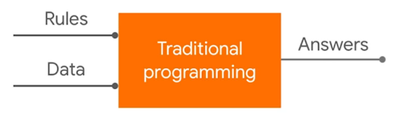
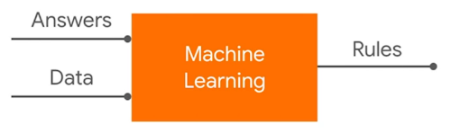
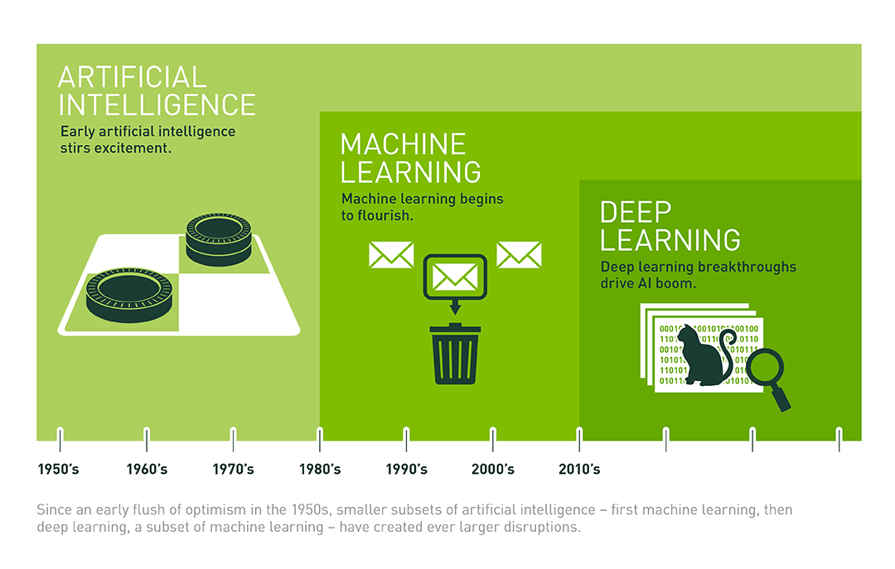

# final_ML_personal
Nguyễn Thị Thu Hồng - 52100962

# DỰ ÁN CUỐI KỲ
# NHẬP MÔN HỌC MÁY
BÀI 1: Trình bày một bài nghiên cứu, đánh giá của em về các vấn đề sau:
1.	Tìm hiểu, so sánh các phương pháp Optimizer trong huấn luyện mô hình học máy;
2.	Tìm hiểu về Continual Learning và Test Production khi xây dựng một giải pháp học máy để giải quyết một bài toán nào đó;

## CHƯƠNG 1 – TỔNG QUAN VỀ HỌC MÁY
### 1.1 Học máy là gì?
Machine learning (học máy hay máy học) là một nhánh con của trí tuệ nhân tạo (AI) và khoa học máy tính. Machine learning sử dụng dữ liệu, thuật toán đầu vào để tự xử lý các vấn đề và liên tục tối ưu để tạo ra những phương án xử lý mới hiệu quả hơn, phù hợp hơn, giống như cách thức tự học của não bộ con người.

Một cách tổng quát, trong cuốn sách Machine Learning của tác giả Tom Mitchell xuất bản năm 1997, học máy được định nghĩa như sau: “A computer program is said to learn to perform a task T from experience E, if its performance at task T, as measured by a performance metric P, improves with experience E over time” (Một chương trình máy tính được cho là học để thực hiện một nhiệm vụ T từ kinh nghiệm E, nếu hiệu suất thực hiện công việc T của nó được đo bởi chỉ số hiệu suất P và được cải thiện bởi kinh nghiệm E theo thời gian).
Khác biệt giữa chương trình lập trình truyền thống và học máy.

Hình 1.1 Minh họa chương trình lập trình truyền thống

Hình 1.1 Minh họa học máy

Thống kê và dự đoán là hai mục đích chính của việc áp dụng machine learning vì thế hệ thống này được thiết kế với khả năng tự nghiên cứu, cải tiến bản thân dựa trên những nguyên lý được lập trình ban đầu. Trong nhiều trường hợp machine learning sẽ tự đề xuất ra giải pháp tối ưu mà không cần được lập trình trước. Do đó, có thể nói Machine Learning giống như một người lao động với khả năng tự học, hoàn thiện và giàu kinh nghiệm hơn theo thời gian.

Trong những năm gần đây, khi mà khả năng tính toán của các máy tính được nâng lên một tầm cao mới và lượng dữ liệu khổng lồ được thu thập bởi các hãng công nghệ lớn, Machine Learning đã tiến thêm một bước dài và một lĩnh vực mới được ra đời gọi là Deep Learning (Học Sâu). Deep Learning đã giúp máy tính thực thi những việc tưởng chừng như không thể vào 10 năm trước: phân loại cả ngàn vật thể khác nhau trong các bức ảnh, tự tạo chú thích cho ảnh, bắt chước giọng nói và chữ viết của con người, giao tiếp với con người, hay thậm chí cả sáng tác văn hay âm nhạc, …

Hình 1.2 Mối quan hệ giữa AI, Machine Learning và Deep Learning

(Nguồn: What’s the Difference Between Artificial Intelligence, Machine Learning, and Deep Learning?)

