# final_ML_personal
Nguyễn Thị Thu Hồng - 52100962

# DỰ ÁN CUỐI KỲ
# NHẬP MÔN HỌC MÁY
BÀI 1: Trình bày một bài nghiên cứu, đánh giá của em về các vấn đề sau:
1.	Tìm hiểu, so sánh các phương pháp Optimizer trong huấn luyện mô hình học máy;
2.	Tìm hiểu về Continual Learning và Test Production khi xây dựng một giải pháp học máy để giải quyết một bài toán nào đó;

## CHƯƠNG 1 – TỔNG QUAN VỀ HỌC MÁY
### 1.1 Học máy là gì?
Machine learning (học máy hay máy học) là một nhánh con của trí tuệ nhân tạo (AI) và khoa học máy tính. Machine learning sử dụng dữ liệu, thuật toán đầu vào để tự xử lý các vấn đề và liên tục tối ưu để tạo ra những phương án xử lý mới hiệu quả hơn, phù hợp hơn, giống như cách thức tự học của não bộ con người.

Một cách tổng quát, trong cuốn sách Machine Learning của tác giả Tom Mitchell xuất bản năm 1997, học máy được định nghĩa như sau: “A computer program is said to learn to perform a task T from experience E, if its performance at task T, as measured by a performance metric P, improves with experience E over time” (Một chương trình máy tính được cho là học để thực hiện một nhiệm vụ T từ kinh nghiệm E, nếu hiệu suất thực hiện công việc T của nó được đo bởi chỉ số hiệu suất P và được cải thiện bởi kinh nghiệm E theo thời gian).
Khác biệt giữa chương trình lập trình truyền thống và học máy.


Hình 1.1 Minh họa chương trình lập trình truyền thống


Hình 1.1 Minh họa học máy

Thống kê và dự đoán là hai mục đích chính của việc áp dụng machine learning vì thế hệ thống này được thiết kế với khả năng tự nghiên cứu, cải tiến bản thân dựa trên những nguyên lý được lập trình ban đầu. Trong nhiều trường hợp machine learning sẽ tự đề xuất ra giải pháp tối ưu mà không cần được lập trình trước. Do đó, có thể nói Machine Learning giống như một người lao động với khả năng tự học, hoàn thiện và giàu kinh nghiệm hơn theo thời gian.

Trong những năm gần đây, khi mà khả năng tính toán của các máy tính được nâng lên một tầm cao mới và lượng dữ liệu khổng lồ được thu thập bởi các hãng công nghệ lớn, Machine Learning đã tiến thêm một bước dài và một lĩnh vực mới được ra đời gọi là Deep Learning (Học Sâu). Deep Learning đã giúp máy tính thực thi những việc tưởng chừng như không thể vào 10 năm trước: phân loại cả ngàn vật thể khác nhau trong các bức ảnh, tự tạo chú thích cho ảnh, bắt chước giọng nói và chữ viết của con người, giao tiếp với con người, hay thậm chí cả sáng tác văn hay âm nhạc, …


Hình 1.2 Mối quan hệ giữa AI, Machine Learning và Deep Learning

(Nguồn: What’s the Difference Between Artificial Intelligence, Machine Learning, and Deep Learning?)

### 1.2 Phân loại Học máy:

Dựa trên các tiêu chí khác nhau, người ta có thể phân loại các thuật toán Học máy theo nhiều cách khác nhau. 

#### 1.2.1 Phân loại theo vấn đề, nhiệm vụ cần giải quyết:

Dựa vào vấn đề, nhiệm vụ cần giải quyết của thuật toán, người ta phân loại các thuật toán Học máy thành ba loại:

1.	Hồi quy (Regression): Giải quyết bài toán dự đoán giá trị một đại lượng nào đó dựa vào giá trị của các đại lượng liên quan. Ví dụ, dựa vào các đặc điểm như diện tích, số phòng, khoảng cách tới trung tâm…để dự đoán giá trị căn nhà.
2.	Phân lớp (Classification): Giải quyết các bài toán nhận dạng xem một đối tượng thuộc lớp nào trong số các lớp cho trước. Ví dụ, bài toán nhận diện chữ viết, bài toán phân loại email…thuộc các thuật toán phân lớp.
3.	Phân cụm (Clustering): Ý tưởng cơ bản giống với các thuật toán phân lớp, sự khác biệt là ở chỗ, trong các bài toán phân cụm, các cụm chưa được xác định trước và thuật toán phải tự khám phá và phân cụm dữ liệu.


Hình 1.3 Các giải thuật Học máy

(Nguồn: https://tailieuhay.vn/tai-lieu/bai-giang-hoc-may-bai-5-cay-phan-loai-va-hoi-quy-nguyen-thanh-tung-7733/ )

#### 1.2.2 Phân loại theo cách máy tính học:

Dựa trên cách máy tính học, người ta chia các thuật toán Học máy thành ba loại:

1.	Học tập dưới sự giám sát (Supervised learning): Con người sẽ lập trình dữ liệu đầu vào bao gồm cả cách thức và phương án mà con người mong muốn. Phương án và đáp án sẽ được gắn nhãn, sắp xếp sẵn và Machine Learning chỉ cần rà soát và trả ra đúng kết quả có trong bộ dữ liệu đã có. Tin nhắn rác đến từ 1 số nguồn sẽ tự động được tách ra khỏi hộp thư chính là ứng dụng của machine learning giúp phân loại tin nhắn trên email.
2.	Học tập mà không giám sát (Unsupervised learning): Machine learning chỉ được cung cấp các thuật toán, công cụ để tự xử lý mà không biết trước kết quả. Dễ thấy nhất việc ứng dụng của phân loại này đó là cá nhân hóa trải nghiệm khách hàng.Dữ liệu đầu vào bao gồm hành vi, lịch sử mua mua hàng và hệ thống sẽ dự đoán những sản phẩm phù hợp và đề xuất riêng cho từng khách hàng.
3.	Học tập được giám sát bán phần (Semi-supervised learning): Đây là phân loại nằm ở giữa của 2 phân loại trên khi này dữ liệu đầu vào là 1 hỗn hợp bao gồm cả phương pháp lẫn đáp án. Điểm khác biệt ở đây là phương án và đáp án chưa được nhóm lại thành từng bộ. Như vậy machine learning phải tự tìm ra cách giải nào tương thích với đáp án nào trong bộ dữ liệu sẵn có.

### 1.3 Các bước cơ bản thực hiện một thuật toán Học máy:

Nhìn chung, việc thực hiện một thuật toán Học máy thường trải qua các bước cơ bản sau:

1.	Thu thập dữ liệu – Gathering data/Data collection
2.	Tiền xử lý dữ liệu – Data preprocessing
    1.	Trích xuất dữ liệu – data extraction
    2.	Làm sạch dữ liệu – data cleaning
    3.	Chuyển đổi dữ liệu – Data transformation
    4.	Chuẩn hóa dữ liệu – Data normalization
    5.	Trích xuất đặc trưng – Feature extraction
3.	Phân tích dữ liệu – Data analysis
4.	Xây dựng mô hình máy học – Model building
5.	Huấn luyện mô hình – Model training
6.	Đánh giá mô hình – Model evaluation
   
Trong tất cả các bước thì việc thu thập dữ liệu, tiền xử lý và xây dựng bộ dữ liệu là tốn nhiều thời gian và công sức nhất. Đây là bước quan trọng, có ảnh hưởng rất nhiều đến hiệu quả của thuật toán Học máy.

### 1.4 Ứng dụng của Học máy:

Ứng dụng tổng quát:

•	Xử lý ảnh
•	Phân tích văn bản
•	Khai phá dữ liệu

Ứng dụng trong thực tế:

•	Giải mã thị trường tài chính

•	Thay đổi cục diện ngành nông nghiệp

•	Nâng cao hiệu quả và cải thiện chất lượng dịch vụ ngành y tế

•	Cơ quan nhà nước có thể quản lý trật tự xã hội và đảm bảo tình hình phát triển đất nước

## CHƯƠNG 2 – CÁC PHƯƠNG PHÁP OPTIMIZER
### 2.1 Tổng quan về Optimizer
#### 2.1.1 Optimizer là gì?
Optimizer hay Thuật toán tối ưu là cơ sở để xây dựng mô hình Neural Network với mục đích “học” được các feature (hay pattern) của dữ liệu đầu vào, để từ đó có thể tìm một tập các trọng số (weights – w) và ngưỡng (bias – b) phù hợp hơn để tối ưu hóa mô hình. 

Và có thể nói các thuật toán tối ưu (Optimizition Algorithm) là một trong những “hạt nhân” mạnh mẽ của hầu hết thuật toán Machine Learning. Đây một quy trình được thực hiện lặp đi lặp lại bằng cách so sánh các giải pháp khác nhau cho đến khi tìm thấy một giải pháp tối ưu hoặc thỏa đáng.

Đối với kỹ thuật học sâu nói riêng, thuật toán tối ưu là các kỹ thuật giúp xây dựng các mô hình mạng nơ-ron để tối ưu hóa độ chính xác của mô hình mạng.


Hình 2.1 Minh họa thuật toán tối ưu (Optimizer)

#### 2.1.2 Vai trò của thuật toán tối ưu

Trong thuật toán học máy nói chung và kỹ thuật học sâu nói riêng, thuật toán tối ưu hóa (Optimizer) là một khâu quan trọng không thể thiếu. Quá trình tối ưu hóa thực hiện xác định hàm mất mát (loss function) và sau đó tối thiểu hóa hàm trên bằng cách sử dụng hàm tối ưu. Cụ thể, thông qua việc cập nhật các tham số của mô hình (w, b) và đánh giá lại hàm mất mát với một tỉ lệ học (learning rate) xác định, quá trình tối ưu giúp mô hình tương thích tốt hơn với tập dữ liệu được đào tạo.

##### 2.1.2.1 Hàm mất mát (Loss function)

Hàm mất mát (Loss function) là một phương pháp đánh giá độ hiệu quả của thuật toán “học” cho mô hình trên tập dữ liệu được sử dụng. 
Hàm mất mát trả về một số thực không âm thể hiện sự chênh lệch giữa hai đại lượng: 

•	a: nhãn được dự đoán

•	y: nhãn đúng

Bản thân hàm mất mát chính là một cơ chế thưởng-phạt, mô hình sẽ phải đóng phạt mỗi lần dự đoán sai và mức phạt tỉ lệ thuận với độ lớn sai sót. 
Trong mọi bài toán học có giám sát, mục tiêu luôn bao gồm giảm tổng mức phạt phải đóng. Trong trường hợp lý tưởng a = y, hàm mất mát sẽ trả về giá trị cực tiểu bằng 0. 
Hai hàm mất mát thường xuyên được sử dụng trong mạng nơ-ron: 

•	MSE (Mean Squared Error)

•	Cross Entropy

##### 2.1.2.2 Tỉ lệ học (Learning rate)

Learning rate hay tỉ lệ học là một thông số quan trọng trong việc quyết định tốc độ học của mạng nơ-ron. Tốc độ học được thể hiện bằng sự thay đổi giá trị cập nhật trọng số (weights - w) trong các chu kỳ học. Tùy theo mục đích của mô hình mà tăng/ giảm tỉ lệ học. 

Tỉ lệ học càng cao thì giúp mô hình học khá nhanh và tiết kiệm được thời gian huấn luyện, tuy nhiên việc tỉ lệ học lớn đồng nghĩa với việc sự thay đổi trọng số (weights - w) và tham số ngưỡng (bias - b) càng lớn, mô hình không ổn định, một số chu kỳ học có sự dao động mạnh ở tỉ lệ nhận dạng đúng hay nói cách khác là thuật toán không được tối ưu và ngược lại đối với tỉ lệ học nhỏ.

#### 2.1.3 Yếu tố đánh giá một thuật toán tối ưu

Một vài các yếu tố hay được sử dụng để đánh giá một thuật toán tối ưu (Optimizer):

•	Hội tụ nhanh (trong quá trình train)

•	Sự tổng quát hóa cao (vẫn nhận dạng được những mẫu chưa từng được huấn luyện)

•	Độ chính xác cao

### 2.2 Một số thuật toán tối ưu (Optimization Algorithms)

Một số thuật toán tối ưu phổ biến:

1.	Gradient Descent
2.	SGD với động lượng
3.	RMSProp
4.	Adagrad
5.	Adadelta
6.	Adam
7.	AdamW
8.	AMSGrad
   
#### 2.2.1 Gradient Descent (GD)

Gradient Descent (GD) là thuật toán tìm tối ưu chung cho các hàm số. Ý tưởng chung của GD là điều chỉnh các tham số để lặp đi lặp lại thông qua mỗi dữ liệu huấn luyện để giảm thiểu hàm chi phí. 

𝑤(𝑘+1) = 𝑤(𝑘) − 𝜂 ∇𝑤 𝐽(𝑤(𝑘) )

Trong đó:

•	𝑤(𝑘) : tham số tại bước cập nhật tại lớp k

•	Η: tỉ lệ học

•	𝐽(𝑤): hàm lỗi

•	∇𝑤 𝐽(𝑤 (𝑘)): đạo hàm của hàm lỗi tại điểm 𝑤(𝑘)

Ví dụ:

```sh
from __future__ import division, print_function, unicode_literals
import math
import numpy as np 
import matplotlib.pyplot as plt

def grad(x):
    return 2*x+ 5*np.cos(x)

def cost(x):
    return x**2 + 5*np.sin(x)

def myGD1(eta, x0):
    x = [x0]
    for it in range(100):
        x_new = x[-1] - eta*grad(x[-1])
        if abs(grad(x_new)) < 1e-3:
            break
        x.append(x_new)
    return (x, it)

(x1, it1) = myGD1(.1, -5)
(x2, it2) = myGD1(.1, 5)
print('Solution x1 = %f, cost = %f, obtained after %d iterations'%(x1[-1], cost(x1[-1]), it1))
print('Solution x2 = %f, cost = %f, obtained after %d iterations'%(x2[-1], cost(x2[-1]), it2))
```
Kết quả:

```sh
Solution x1 = -1.110667, cost = -3.246394, obtained after 11 iterations
Solution x2 = -1.110341, cost = -3.246394, obtained after 29 iterations
```
	Điểm khởi tạo khác nhau

Sau khi có các hàm cần thiết, tôi thử tìm nghiệm với các điểm khởi tạo khác nhau là x0 = −5 và x0 = 5.

 

Hình 2.2 Minh họa thuật toán GD với điểm khởi tạo khác nhau

Từ hình minh họa trên ta thấy rằng ở hình bên trái, tương ứng với x0 =−5, nghiệm hội tụ nhanh hơn, vì điểm ban đầu x0 gần với nghiệm x* ≈ −1 hơn. Hơn nữa, với x0 =5 ở hình bên phải, đường đi của nghiệm có chứa một khu vực có đạo hàm khá nhỏ gần điểm có hoành độ bằng 2. 

=>	Điều này khiến cho thuật toán la cà ở đây khá lâu. Khi vượt qua được điểm này thì mọi việc diễn ra rất tốt đẹp.

	Learning rate khác nhau

Tốc độ hội tụ của GD không những phụ thuộc vào điểm khởi tạo ban đầu mà còn phụ thuộc vào learning rate. 

Ví dụ với cùng điểm khởi tạo x0 = −5 nhưng learning rate khác nhau:

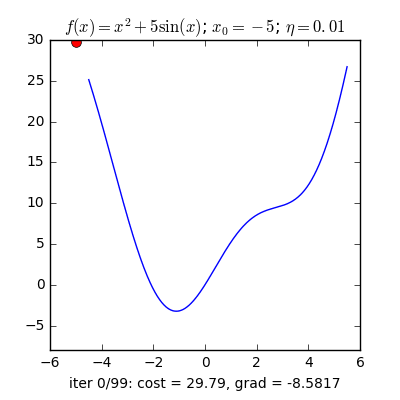 

Hình 2.3 Minh họa thuật toán GD với Learning rate khác nhau

Ta quan sát thấy hai điều:

1.	Với learning rate nhỏ η=0.01, tốc độ hội tụ rất chậm. Trong ví dụ, do chọn tối đa 100 vòng lặp nên thuật toán dừng lại trước khi tới đích, mặc dù đã rất gần. Trong thực tế, khi việc tính toán trở nên phức tạp, learning rate quá thấp sẽ ảnh hưởng tới tốc độ của thuật toán rất nhiều, thậm chí không bao giờ tới được đích.
2.	Với learning rate lớn η=0.5, thuật toán tiến rất nhanh tới gần đích sau vài vòng lặp. Tuy nhiên, thuật toán không hội tụ được vì bước nhảy quá lớn, khiến nó cứ quẩn quanh ở đích.
   
	Việc lựa chọn learning rate rất quan trọng trong các bài toán thực tế. Việc lựa chọn giá trị này phụ thuộc nhiều vào từng bài toán và phải làm một vài thí nghiệm để chọn ra giá trị tốt nhất. Ngoài ra, tùy vào một số bài toán, GD có thể làm việc hiệu quả hơn bằng cách chọn ra learning rate phù hợp hoặc chọn learning rate khác nhau ở mỗi vòng lặp.

Có một số biến thể khác nhau của GD tùy thuộc vào số lượng dữ liệu được sử dụng để tính gradient của hàm mất mát. Gồm: 

1.	Batch Gradient Descent (Batch GD)
2.	Stochastic Gradient Descent (SGD)
3.	Mini-batch Gradient Descent (Mini-batch GD)
   
##### 2.2.1.1 Batch Gradient Descent (Batch GD)

Thuật toán Batch Gradient Descent (Batch GD) tính gradient của hàm mất mát tại w trên toàn bộ tập dữ liệu. Tất cả các điểm dữ liệu đều được sử dụng để tính gradient trước khi cập nhật bộ trọng số w. Hạn chế của Batch GD là khi tập dữ liệu lớn, việc tính gradient sẽ tốn nhiều thời gian và chi phí tính toán.

##### 2.2.1.2 Stochastic Gradient Descent (SGD)

Để khắc phục hạn chế của Bathc GD, thuật toán Stochastic Gradient Descent (SGD) thực hiện việc cập nhật trọng số với mỗi mẫu dữ liệu x(i) có nhãn tương ứng y(i) như sau: 

𝑤(𝑘+1) = 𝑤(𝑘) − 𝜂 ∇𝑤 𝐽(𝑤(𝑘), x(i), y(i))

Với cách cập nhật này, SGD thường nhanh hơn Batch GD và có thể sử dụng để học trực tuyến (online learning) khi tập dữ liệu huấn luyện được cập nhật liên tục. 

Với SGD, bộ trọng số w được cập nhật thường xuyên hơn so với Batch GD và vì vậy hàm mất mát cũng dao động nhiều hơn. Sự dao động này khiến SGD có vẻ không ổn định nhưng lại có điểm tích cực là nó giúp di chuyển đến những điểm cực tiểu (địa phương) mới có tiềm năng hơn. Với tốc độ học giảm, khả năng hội tụ của SGD cũng tương đương với Batch GD.

Hàm số trong Python để giải Linear Regression theo SGD:

```sh
def sgrad(w, i, rd_id):
    true_i = rd_id[i]
    xi = Xbar[true_i, :]
    yi = y[true_i]
    a = np.dot(xi, w) - yi
    return (xi*a).reshape(2, 1)

def SGD(w_init, grad, eta):
    w = [w_init]
    w_last_check = w_init
    iter_check_w = 10
    N = X.shape[0]
    count = 0
    for it in range(10):  
# shuffle data 
        rd_id = np.random.permutation(N)
        for i in range(N):
            count += 1 
            g = sgrad(w[-1], i, rd_id)
            w_new = w[-1] - eta*g
            w.append(w_new)
            if count%iter_check_w == 0:
                w_this_check = w_new                 
                if np.linalg.norm(w_this_check - w_last_check)/len(w_init) < 1e-3:                                    
                    return w
                w_last_check = w_this_check
    return w
```

Kết quả thu được:

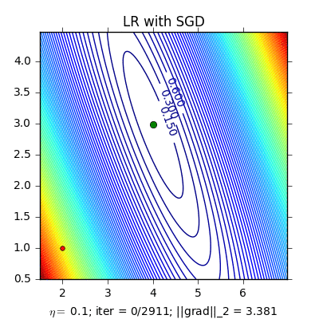 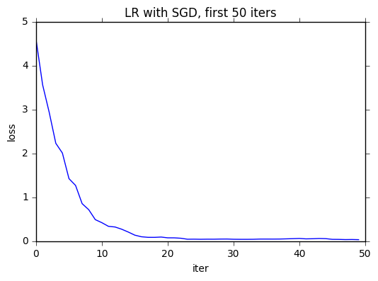
Hình 2.4 Trái: đường đi của nghiệm với SGD. Phải: giá trị của Loss function tại 50 vòng lặp đầu tiên.

##### 2.2.1.3 Mini-batch Gradient Descent (Mini-batch GD)

Cách tiếp cận thứ ba là thuật toán Mini-batch Gradient Descent (Mini-batch GD). Khác với hai thuật toán trước, Mini-batch GD sử dụng t điểm dữ liệu để cập nhật bộ trọng số (1<t<N) với N là tổng số điểm dữ liệu). 

𝑤(𝑘+1) = 𝑤(𝑘) − 𝜂 ∇𝑤 𝐽(𝑤(𝑘), x(i: i+t), y(i: i+t))

Với x(i: i+t) được hiểu là dữ liệu từ thứ i tới thứ i+t−1. Dữ liệu này sau mỗi epoch là khác nhau vì chúng cần được xáo trộn. Một lần nữa, các thuật toán khác cho GD như Momentum, Adagrad, Adadelta, … cũng có thể được áp dụng vào đây. Giá trị t thường được chọn là khoảng từ 50 đến 100. 

Mini-batch GD giảm sự dao động của hàm mất mát so với SGD và chi phí tính gradient với k điểm dữ liệu là chấp nhận được. 

Mini-batch GD thường được lựa chọn khi huấn luyện mạng nơron và vì vậy trong một số trường hợp, SGD được hiểu là Mini-batch GD. Riêng bản thân Mini-batch GD không đảm bảo tìm được điểm cực tiểu của hàm mất mát mà bên cạnh đó các yếu tố như tốc độ học, thuộc tính dữ liệu và tính chất của hàm mất mát cũng ảnh hưởng đến điều này.

Ví dụ về giá trị của hàm mất mát mỗi khi cập nhật tham số w của một bài toán khác:

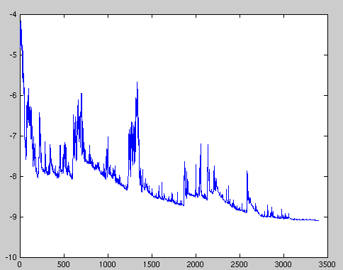
Hình 2.5 Ví dụ về Mini-batch Gradient Descent

	Hàm mất mát nhảy lên nhảy xuống (fluctuate) sau mỗi lần cập nhật nhưng nhìn chung giảm dần và có xu hướng hội tụ về cuối.

#### 2.2.2 SGD với động lượng (SGD with momentum)

SGD với momentum là phương pháp giúp tăng tốc các vectơ độ dốc theo đúng hướng, và giúp hệ thống hội tụ nhanh hơn. Đây là một trong những thuật toán tối ưu hóa phổ biến nhất và nhiều mô hình hiện đại sử dụng nó để đào tạo. 

Mô tả như sau: 

𝑣𝑗 ← 𝛼 ∗ 𝑣𝑗 − 𝜂 ∗ 𝛻𝑊 ∑_1^m▒〖L_m (w) 〗 

𝑤𝑗 ← 𝑣𝑗 + 𝑤𝑗

Phương trình có hai phần. Trong đó:

	vj: độ dốc được giữ lại từ các lần lặp trước
 
	Hệ số động lượng α: tỉ lệ phần trăm của độ dốc được giữ lại mỗi lần lặp
 
	L: hàm mất mát
 
	η: tỉ lệ học

#### 2.2.3 RMSProp (Root Mean Square Propogation)

RMSProp sử dụng trung bình bình phương của gradient để chuẩn hóa gradient. Có tác dụng cân bằng kích thước bước - giảm bước cho độ dốc lớn để tránh hiện tượng phát nổ độ dốc (Exploding Gradient), và tăng bước cho độ dốc nhỏ để tránh biến mất độ dốc (Vanishing Gradient). RMSProp tự động điều chỉnh tốc độ học tập, và chọn một tỉ lệ học tập khác nhau cho mỗi tham số. 

Phương pháp cập nhật các trọng số được thực hiện như mô tả:

𝑠𝑡 = 𝜌𝑠𝑡−1 + (1 − 𝜌) ∗ g_t^2

𝛥𝑥𝑡 = -η/√(s_t  + ϵ) ∗ 𝑔𝑡 

𝑥𝑡+1 = 𝑥𝑡 + 𝛥𝑥t

Trong đó:

	𝑠𝑡: tích luỹ phương sai của các gradient trong quá khứ
 
	𝜌: tham số suy giảm
 
	𝛥𝑥𝑡: sự thay đổi các tham số trong mô hình
 
	𝑔𝑡: gradient của các tham số tại vòng lặp t
 
	ϵ: tham số đảm bảo kết quả xấp xỉ có ý nghĩa.
 
#### 2.2.4 Adagrad

Adagrad là một kỹ thuật học máy tiên tiến, thực hiện giảm dần độ dốc bằng cách thay đổi tốc độ học tập. Adagrad được cải thiện hơn bằng cách cho trọng số học tập chính xác dựa vào đầu vào trước nó để tự điều chỉnh tỉ lệ học theo hướng tối ưu nhất thay vì với một tỉ lệ học duy nhất cho tất cả các nút.

Thuật toán Adagrad được Duchi J. và các cộng sự đề xuất năm 2011. Khác với SGD, tốc độ học trong Adagrad thay đổi tùy thuộc vào trọng số: tốc độ học thấp đối với các trọng số tương ứng với các đặc trưng phổ biến, tốc độ học cao đối với các trọng số tương ứng với các đặc trưng ít phổ biến.

gt, i  = ∇wJ (wt, i)

Trong đó:

	gt: gradient của hàm mất mát tại bước t
 
	gt, i :  đạo hàm riêng của hàm mất mát theo wi tại bước t
 
Quy tắc cập nhật của Adagrad:

w𝑡+1, i = wt, i -η/√(G_(t,ii)  + ϵ) ∗ 𝑔𝑡, i

Theo quy tắc cập nhật, Adagrad điều chỉnh tốc độ học η tại bước t tương ứng với trọng số wi xác định dựa trên các gradient đã tính được theo wi. 

	Mẫu số là chuẩn L2 (L2 norm) của ma trận đường chéo Gt trong đó phần tử i,i là tổng bình phương của các gradient tương ứng với wi tính đến bước t.
 
	ε là một số dương khá nhỏ nhằm tránh trường hợp mẫu số bằng 0.
 
Quy tắc cập nhật trên có thể viết dưới dạng tổng quát hơn như sau:

w𝑡+1 = wt -η/√(G_t  + ϵ) ⨀𝑔𝑡

Trong đó, ⨀ là phép nhân ma trận-vectơ giữa Gt và gt . 

Có thể nhận thấy rằng trong thuật toán Adagrad tốc độ học được tự động điều chỉnh. Adagrad thường khá hiệu quả đối với bài toán có dữ liệu phân mảnh. Tuy nhiên, hạn chế của Adagrad là các tổng bình phương ở mẫu số ngày càng lớn khiến tốc độ học ngày càng giảm và có thể tiệm cận đến giá trị 0 khiến cho quá trình huấn luyện gần như đóng băng. Bên cạnh đó, giá trị tốc độ học η cũng phải được xác định một cách thủ công.

#### 2.2.5 Adadelta

Thuật toán Adadelta được Zeiler và các cộng sự đề xuất năm 2012. Adadelta là một biến thể của Adagrad để khắc phục tình trạng giảm tốc độ học ở Adagrad. Adadelta không có tham số tỉ lệ học cho nên, thay vì lưu lại tất cả gradient như Adagrad, Adadelta giới hạn tích lũy gradient theo cửa sổ có kích thước cố định của trọng số w. Bằng cách này, Adadelta vẫn tiếp tục học sau nhiều bước cập nhật.

g_t^'= √((〖Δx〗_(t-1)+ϵ)/(s_t+ϵ)) *𝑔𝑡 

𝑥𝑡 = 𝑥𝑡−1 − g_t^' 

𝛥𝑥𝑡 = 𝜌𝛥𝑥𝑡−1 + (1 − 𝜌) x_t^2

Từ công thức, Adadelta sử dụng 2 biến trạng thái: 

	𝑠𝑡: để lưu trữ trung bình của khoảng thời gian thứ hai của gradient và Δ𝑥𝑡 để lưu trữ trung bình của khoảng thời gian thứ 2 của sự thay đổi các tham số trong mô hình. 
 
	g_t^': căn bậc hai thương của trung bình tốc độ thay đổi bình phương và trung bình mô-men bậc hai của gradient. 
 
#### 2.2.6 Adam

Adam được xem như là sự kết hợp của RMSprop và Stochastic Gradient Descent với động lượng. Adam là một phương pháp tỉ lệ học thích ứng, nó tính toán tỉ lệ học tập cá nhân cho các tham số khác nhau. Adam sử dụng ước tính của khoảng thời gian thứ nhất và thứ hai của độ dốc để điều chỉnh tỉ lệ học cho từng trọng số của mạng nơ-ron.

Tuy nhiên, qua nghiên cứu thực nghiệm, trong một số trường hợp, Adam vẫn còn gặp phải nhiều thiếu sót so với thuật toán SGD. Thuật toán Adam được mô tả: 

𝑚𝑡 = 𝛽1𝑚𝑡−1 + (1 − 𝛽1)𝑔𝑡

𝑣𝑡 = 𝛽2𝑣𝑡−1 + (1 − 𝛽2) g_t^2

Trong đó:

	vt là trung bình động của bình phương
 
	mt là trung bình động của gradient
 
	β1và β2 là tốc độ của di chuyển
 
#### 2.2.7 AdamW

AdamW là một biến thể của Adam. Ý tưởng của AdamW khá đơn giản: khi thực hiện thuật toán Adam với L2 regularization (chuẩn hóa L2), tác giả loại bỏ phần tiêu biến của trọng số (weight decay) wtθt khỏi công thức tính gradient hàm mất mát tại thời điểm t: 

gt = 𝛥f(θt) + wtθt

và thay vào đó, đưa phần giá trị đã được phân tách này vào quá trình cập nhật trọng số: 

θ_(t+1,i)=θ_(t,i)-η(1/√((v_t ) ̂+ϵ)*(m_t ) ̂+w_(t,i) θ_(t,i) ),∀t

#### 2.2.8 AMSGrad

AMSGrad sử dụng giá trị lớn nhất của các bình phương gradient trước đó vt để cập nhật các trọng số. Ở đây, vt cũng được định nghĩa như trong thuật toán Adam: 

𝑣𝑡 = 𝛽2𝑣𝑡−1 + (1 − 𝛽2) g_t^2

Thay vì trực tiếp sử dụng vt (hay giá trị ước lượng (v_t ) ̂ ), thuật toán sẽ sử dụng giá trị trước đó vt-1 nếu giá trị này lớn hơn giá trị hiện tại: 

(v_t ) ̂=max⁡((v_(t-1) ) ̂,v_t) 

Tương tự như trong thuật toán Adam, các giá trị được ước lượng theo công thức dưới đây để khử lệch cho các trọng số:

𝑚𝑡 = 𝛽1𝑚𝑡−1 + (1 − 𝛽1)𝑔𝑡

𝑣𝑡 = 𝛽2𝑣𝑡−1 + (1 − 𝛽2) g_t^2

(v_t ) ̂=max⁡((v_(t-1) ) ̂,v_t) 

AMSGrad được cập nhật theo quy tắc:

w𝑡+1 = wt -η/√((v_t ) ̂  + ϵ)*m𝑡

### 2.3 So sánh các thuật toán tối ưu với bộ dữ liệu MNIST và CIFAR-10
#### 2.3.1 Cơ sở dữ liệu
##### 2.3.1.1 MNIST

Bộ dữ liệu MNIST là bộ dữ liệu gồm các hình ảnh xám (grayscale picture) các chữ số viết tay được chia sẻ bởi Yann Lecun bao gồm 70000 ảnh chữ số viết tay được chia thành 2 tập: tập huấn luyện gồm 60000 ảnh và tập kiểm tra 10000 ảnh. Các chữ số viết tay ở tập MNIST được chia thành 10 nhóm tương ứng với các chữ số từ 0 đến 9. Tất cả hình ảnh trong tập MNIST đều được chuẩn hóa với kích thước 28 x 28 điểm ảnh. Dưới đây là một số hình ảnh được trích xuất từ bộ dữ liệu.

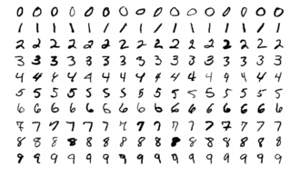

Hình 2.6 Hình ảnh chữ số viết tay từ tập MNIST

(https://vi.wikipedia.org/wiki/C%C6%A1_s%E1%BB%9F_d%E1%BB%AF_li%E1%BB%87u_MNIST)

###### 2.3.1.2 CIFAR-10

Bộ cơ sở dữ liệu CIFAR-10 là bộ dữ liệu chứa các ảnh màu có kích thước 32 x 32 x 3 (3 lớp màu RGB) trong 10 nhóm khác nhau, gồm: máy bay, ô tô, chim, mèo, hươu, chó, ếch, ngựa, tàu và xe tải. Mỗi nhóm gồm 6000 hình ảnh, cùng với sự đa dạng về các thành phần như độ sáng, vị trí, hướng của các đối tượng. Nó là một trong những bộ dữ liệu được sử dụng rộng rãi nhất cho nghiên cứu máy học bao gồm 60000 ảnh được chia thành 2 tập: tập huấn luyện gồm 50000 ảnh và tập kiểm tra 10000 ảnh.

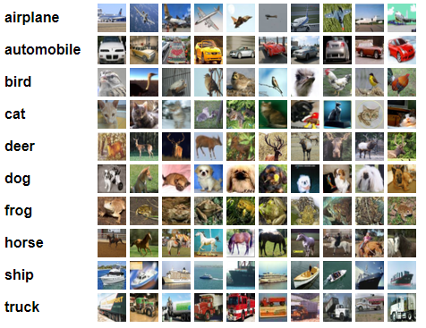

Hình 2.7 Một số hình ảnh từ bộ dữ liệu chứa ảnh CIFAR-10

(https://www.cs.toronto.edu/~kriz/cifar.html)

###### 2.3.1.3 CINIC-10

Bộ cơ sở dữ liệu CINIC-10 gồm 270,000 bức ảnh, thuộc về 10 lớp khác nhau như ở CIFAR-10, chia làm 3 phần: tập huấn luyện, tập kiểm thử và tập kiểm định, mỗi tập có 90,000 phần tử. CINIC có thể coi là tập mở rộng của CIFAR-10, bổ sung thêm nhiều phần tử ảnh trích xuất từ tập ImageNet và được chỉnh sửa để có kích thước tương tự với phần tử ảnh trong tập CIFAR-10. 
CINIC-10 có tập kiểm thử lên đến 90,000 phần tử. Theo [5], việc các mẫu dữ liệu trích xuất từ ImageNet bị giảm kích thước thành 32x32 sẽ làm tăng độ khó của việc phân lớp do số lượng đặc trưng ít hơn. Việc tập huấn luyện và tập kiểm thử có tỉ lệ 1:1 cũng sẽ giúp đánh giá được khả năng khái quát hóa của mô hình.


Hình 2.8 Một số hình ảnh từ bộ dữ liệu chứa ảnh CINIC-10

(https://paperswithcode.com/dataset/cinic-10) 

#### 2.3.2 Kết quả

##### 2.3.2.1 Kết quả với bộ dữ liệu MNIST

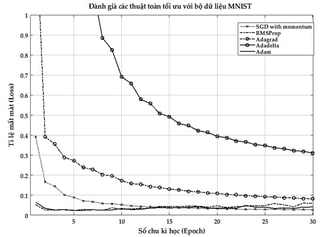">

Hình 2.9 Tỉ lệ mất mát của các thuật toán tối ưu trên tập dữ liệu MNIST

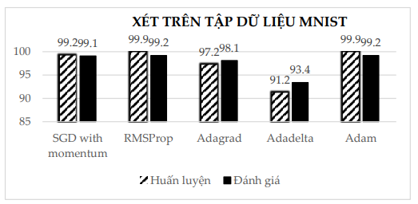

Hình 2.10 Tỉ lệ nhận dạng đúng của các thuật toán trên tập huấn luyện và tập đánh giá của tập dữ liệu MNIST

##### 2.3.2.2 Kết quả với bộ dữ liệu CIFAR-10

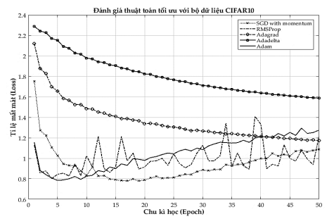

Hình 2.11 Tỉ lệ mất mát của các thuật toán tối ưu trên tập dữ liệu CIFAR-10

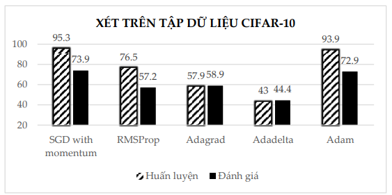

Hình 2.12 Tỉ lệ nhận dạng đúng của các thuật toán trên tập huấn luyện và tập đánh giá của tập dữ liệu CIFAR-10

##### 2.3.2.3 Kết quả với bộ dữ liệu CINIC-10

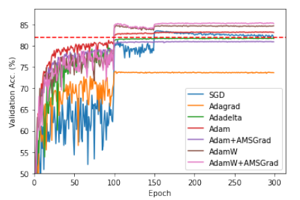

Hình 2.13 Độ chính xác của mô hình ResNet110 huấn luyện trên tập CINIC-10

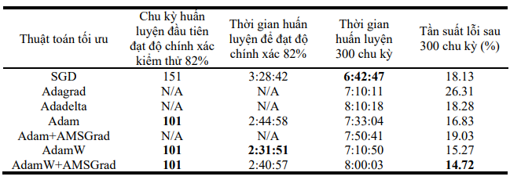

Hình 2.14 Kết quả thử nghiệm với tập CINIC-10

(các giá trị in đậm là các kết quả tốt nhất của mỗi cột)

## CHƯƠNG 3 – CONTINUAL LEARNING VÀ TEST PRODUCTION

### 3.1 Continual Learning

#### 3.1.1 Continual Learning là gì?

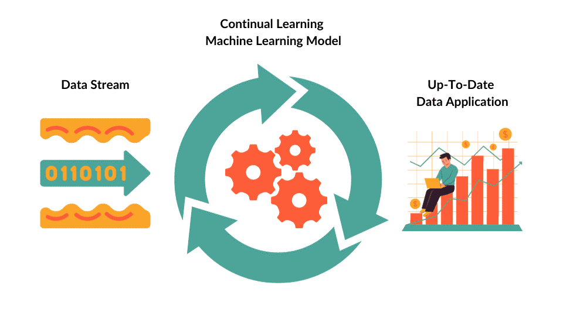

Hình 3.1 Continual Learning

Continual Learning (còn gọi là Incremental Learning, Life-long Learning) là là một mô hình học máy tập trung vào các mô hình đào tạo để tiếp thu kiến thức mới và thích ứng với việc thay đổi dữ liệu theo thời gian.. Ngược lại với học máy truyền thống, trong đó các mô hình thường được đào tạo trên các tập dữ liệu cố định và giả định rằng việc phân phối dữ liệu không đổi, học liên tục được thiết kế để xử lý các phân phối dữ liệu đang phát triển và liên tục học hỏi từ dữ liệu mới trong khi vẫn giữ được kiến thức từ những trải nghiệm trước đó. Điều này đặc biệt quan trọng trong các trường hợp dữ liệu không cố định, nghĩa là nó thay đổi theo thời gian.

Ngoài ra, hệ thống Continual Learning có thể được định nghĩa là một thuật toán thích ứng có khả năng học từ một luồng thông tin liên tục, với thông tin đó sẽ dần dần có sẵn theo thời gian và trong đó số lượng nhiệm vụ cần học (Ví dụ: các lớp thành viên trong một nhiệm vụ phân loại) không được xác định trước . Điều quan trọng là việc cung cấp thông tin mới phải diễn ra mà không bị lãng quên hoặc can thiệp một cách nghiêm trọng.

#### 3.1.2 Các thách thức chính và giải pháp liên quan đến Continual Learning

##### 3.1.2.1 Sự quên lãng nghiêm trọng (Catastrophic Forgetting)

Một trong những thách thức chính trong việc học tập liên tục là ngăn chặn tình trạng quên lãng nghiêm trọng. Điều này đề cập đến hiện tượng một mô hình quên thông tin đã học trước đó khi được huấn luyện trên dữ liệu mới. Nhiều kỹ thuật khác nhau đã được phát triển để giải quyết vấn đề này, chẳng hạn như phương pháp chính quy hóa, bộ đệm phát lại và phương pháp tiếp cận kiến trúc như là bộ nhớ phân đoạn thần kinh (neural episodic memories).

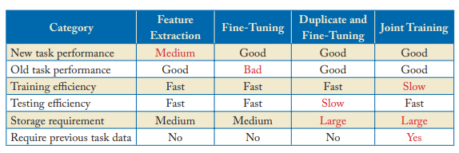

Hình 3.2 Tóm tắt các phương pháp truyền thống để giải quyết sự quên lãng nghiêm trọng

1.	Bộ đệm phát lại (Replay Buffers)

Bộ đệm phát lại lưu trữ một tập hợp con dữ liệu trong quá khứ và sử dụng nó trong quá trình đào tạo để giúp mô hình lưu giữ kiến thức về các tác vụ trước đó. Điều này cho phép mô hình xem lại và huấn luyện dữ liệu cũ để giảm thiểu tình trạng quên dữ liệu theo định kỳ.

2.	Chính quy hóa (Regularization)

Các kỹ thuật như elastic weight consolidation (EWC) và synaptic intelligence (SI) đưa ra các thuật ngữ chính quy hóa cho loss function , xử phạt các thay đổi đối với các tham số thiết yếu quan trọng cho các tác vụ trước đây. Điều này giúp mô hình lưu giữ kiến thức về các nhiệm vụ trước đó.

3.	Phương pháp tiếp cận kiến trúc (Architectural Approaches)

Một số phương pháp liên quan đến việc sửa đổi kiến trúc neural network để tạo điều kiện cho việc học tập liên tục. Ví dụ: progressive neural networks (PNNs) tăng dần mạng khi học được các nhiệm vụ mới, trong khi các mạng khác sử dụng kiến trúc mô-đun hoặc có thể mở rộng.

4.	Học chuyển giao (Transfer Learning)

Các kỹ thuật  học chuyển giao có thể được điều chỉnh cho phù hợp với các tình huống học tập liên tục khi một mô hình được đào tạo trước trên một tập dữ liệu lớn và sau đó tinh chỉnh cho một nhiệm vụ mới. Các mô hình được đào tạo trước về dữ liệu đa dạng có thể khái quát hóa tốt hơn khi học dần các nhiệm vụ mới.

5.	Siêu học tập (Meta-Learning)

Siêu học tập là một cách tiếp cận khác có thể giúp các mô hình thích ứng nhanh chóng với các nhiệm vụ mới. Các thuật toán siêu học tập đào tạo các mô hình cách học, giúp chúng tiếp thu kiến thức mới hiệu quả hơn.

###### 3.1.2.2 Số liệu đánh giá (Evaluation Metrics)

Việc phát triển các số liệu đánh giá phù hợp cho việc học tập liên tục là một thách thức vì các số liệu truyền thống có thể không nắm bắt đầy đủ khả năng ghi nhớ các nhiệm vụ cũ của mô hình trong khi học các nhiệm vụ mới. Các số liệu như độ chính xác trung bình trên tất cả các tác vụ (MAOT) hoặc hiệu suất phát lại bộ nhớ thường được sử dụng.

#### 3.1.3 Các bước và chiến lược để thực hiện Continual Learning

1.	Quản lý dữ liệu:

•	Thiết lập hệ thống quản lý dữ liệu để xử lý các luồng dữ liệu hoặc tác vụ đến.

•	Lưu trữ dữ liệu trong quá khứ và làm cho nó có thể truy cập được để cập nhật mô hình.

2.	Kỹ thuật chính quy hóa:

•	Sử dụng các kỹ thuật chính quy hóa để bảo vệ các tham số mô hình quan trọng liên quan đến các tác vụ trước đó.

•	Các ví dụ bao gồm Elastic Weight Consolidation (EWC), Synaptic Intelligence (SI) và chính quy hóa dựa trên đường dẫn.

4.	Học trực tuyến:

•	Triển khai học tập trực tuyến, trong đó mô hình cập nhật liên tục khi có dữ liệu mới.

•	Sử dụng các cập nhật nhỏ hoặc cập nhật gia tăng để thích ứng với thông tin mới.

5.	Phát lại bộ nhớ

•	Triển khai học tập trực tuyến, trong đó mô hình cập nhật liên tục khi có dữ liệu mới.

•	Sử dụng các cập nhật nhỏ hoặc cập nhật gia tăng để thích ứng với thông tin mới.

6.	Chuyển tiếp học tập

•	Triển khai học tập trực tuyến, trong đó mô hình cập nhật liên tục khi có dữ liệu mới.

•	Sử dụng các cập nhật nhỏ hoặc cập nhật gia tăng để thích ứng với thông tin mới.

7.	Sửa đổi kiến trúc

•	Thử nghiệm các sửa đổi kiến trúc cho phép mô hình thích ứng và mở rộng khi có nhiệm vụ mới.

•	Progressive neural networks, kiến trúc mô-đun và các mô hình có thể mở rộng là những ví dụ.

8.	Đánh giá thường xuyên

•	Liên tục đánh giá hiệu quả hoạt động của mô hình trên cả nhiệm vụ mới và cũ.

•	Sử dụng các số liệu đánh giá thích hợp, chẳng hạn như độ chính xác trung bình trên tất cả các nhiệm vụ (MAOT), để theo dõi tiến độ.

9.	Tỷ lệ quên động

•	Triển khai các chiến lược hoặc tỷ lệ quên linh hoạt cho mô hình để kiểm soát tốc độ quên thông tin cũ.

•	Làm cho quá trình quên thích ứng với tầm quan trọng của các nhiệm vụ trong quá khứ.

10.	Siêu học tập

•	Khám phá các kỹ thuật siêu học tập, trong đó mô hình học cách thích ứng nhanh chóng với các nhiệm vụ mới bằng cách đào tạo về nhiều nhiệm vụ khác nhau.

11.	Cơ chế phát hiện trôi dạt

•	Phát triển các cơ chế để phát hiện sự trôi dạt khái niệm hoặc những thay đổi trong phân phối dữ liệu.

•	Cập nhật mô hình kích hoạt khi phát hiện sai lệch khái niệm quan trọng.

12.	Nhãn nhiệm vụ

•	Sử dụng nhãn nhiệm vụ hoặc siêu thông tin để hướng dẫn quá trình học tập của mô hình nếu có.

•	Thông tin về nhiệm vụ cụ thể có thể giúp mô hình giữ lại hoặc quên thông tin một cách có chọn lọc.

13.	Bảo trì thường xuyên

•	Các mô hình học tập liên tục đòi hỏi phải duy trì và giám sát thường xuyên.

•	Cập nhật và tinh chỉnh các mô hình khi có dữ liệu mới hoặc khi môi trường thay đổi.

14.	Cân bằng dữ liệu

•	Giải quyết các vấn đề mất cân bằng dữ liệu có thể phát sinh khi có nhiệm vụ hoặc luồng dữ liệu mới.

•	Đảm bảo rằng mô hình không overfiting với dữ liệu gần đây nhất.

15.	Bộ dữ liệu và nhiễm vụ Benchmark

•	Đánh giá các thuật toán học tập liên tục của bạn trên các tập dữ liệu và nhiệm vụ tiêu chuẩn để so sánh hiệu suất của chúng với các phương pháp hiện có.

#### 3.1.4 4 thuật toán Continual Learning

##### 3.1.4.1 Progressive Neural Networks (PNNs)

Mạng thần kinh tiến bộ (PNN) được thiết kế để học dần dần các nhiệm vụ mới trong khi vẫn duy trì kiến thức về các nhiệm vụ đã biết trước đó. Ý tưởng chính đằng sau PNN là mở rộng công suất của mô hình khi có nhiệm vụ mới. Thay vì sử dụng một mạng nơron đơn lẻ, PNN sử dụng một tập hợp mạng. Mỗi mạng trong nhóm được dành riêng cho một nhiệm vụ cụ thể. Một mạng lưới thần kinh mới được thêm vào tập hợp khi một nhiệm vụ mới được đưa ra. Sau đó, mô hình kết hợp đầu ra của tất cả các mạng để đưa ra dự đoán.

Lợi ích của PNN là chúng ngăn chặn sự quên lãng nghiêm trọng bằng cách cô lập kiến thức liên quan đến từng nhiệm vụ trong các mạng chuyên dụng. Tuy nhiên, tập hợp có thể trở nên lớn khi có nhiều nhiệm vụ được học, điều này có thể dẫn đến độ phức tạp tính toán tăng lên.

##### 3.1.4.2 Learning without Forgetting (LwF)

Học mà không quên (LwF) là một phương pháp tiếp cận tận dụng việc chắt lọc kiến thức để giải quyết tình trạng quên lãng nghiêm trọng. Ý tưởng là sử dụng mô hình được đào tạo trước làm mạng giáo viên và mạng lưới thần kinh mới làm học sinh. Khi học một nhiệm vụ mới, mạng học sinh được huấn luyện để bắt chước dự đoán của giáo viên về dữ liệu cũ và mới. Quá trình này giúp mạng học sinh ghi nhớ được kiến thức từ các nhiệm vụ trước đó.

LwF có hiệu quả về mặt tính toán vì nó không yêu cầu duy trì một tập hợp mạng lớn. Nó đặc biệt thành công trong các tình huống mà việc tinh chỉnh mô hình được đào tạo trước là có lợi.

##### 3.1.4.3 iCaRL (Incremental Classifier and Representation Learning)

iCaRL (Học phân loại và biểu diễn tăng dần) là một thuật toán được thiết kế cho các nhiệm vụ học tập liên tục liên quan đến phân loại. Nó kết hợp các chiến lược để học biểu diễn tính năng và lưu trữ mẫu dành riêng cho lớp. Mô hình duy trì một tập hợp các mẫu (mẫu đại diện) từ mỗi lớp đã học trước đó. Khi các lớp mới được giới thiệu, iCaRL sử dụng các mẫu này để lưu giữ kiến thức về các lớp cũ.

iCaRL rất phù hợp cho các nhiệm vụ cần quan tâm đến sự mất cân bằng lớp vì nó đảm bảo rằng mô hình giữ lại kiến thức của cả lớp cũ và lớp mới trong khi thích ứng với dữ liệu mới.

##### 3.1.4.4 Meta-Learning Approaches

Siêu học tập (Meta-Learning) bao gồm các mô hình đào tạo để học hiệu quả và cũng đã được áp dụng cho việc học tập liên tục. Trong siêu học tập để học liên tục, các mô hình được đào tạo về nhiều nhiệm vụ khác nhau để có được chiến lược khởi tạo hoặc học tập tốt nhằm thích ứng nhanh chóng với các nhiệm vụ mới.

Các kỹ thuật siêu học đã cho thấy nhiều hứa hẹn trong việc giảm thiểu tình trạng quên lãng nghiêm trọng bằng cách trang bị cho các mô hình một điểm khởi đầu vững chắc để học các nhiệm vụ mới.
##### 3.1.5 Thuốc đo đánh giá về Continual Learning

1.	Độ chính xác trung bình trên tất cả các nhiệm vụ (MAOT)
2.	Duy trì hiệu suất nhiệm vụ
3.	Hiệu suất phát lại bộ nhớ
4.	Số liệu dành riêng cho nhiệm vụ
5.	Tốc độ thích ứng và sử dụng tài nguyên
6.	Quy trình đánh giá

### 3.2 Test Production

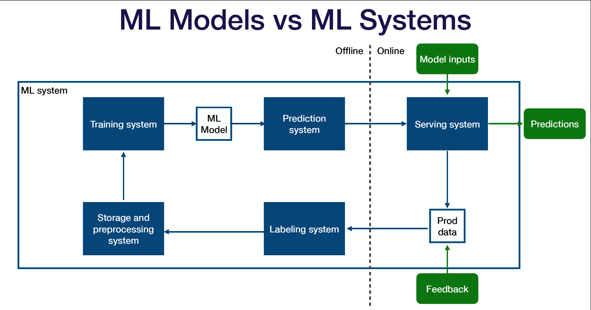

Hình 3.3 Sơ đồ hệ thống ML và mô hình ML

•	Ở giữa là mô hình ML - một tạo phẩm được tạo bởi quá trình đào tạo, mô hình này nhận đầu vào và tạo ra đầu ra.

•	Hệ thống đào tạo (Training system) lấy mã và dữ liệu làm đầu vào và tạo ra mô hình được đào tạo (ML model) làm đầu ra.

•	Hệ thống dự đoán (Prediction system) tiếp nhận và xử lý trước dữ liệu thô, tải mô hình ML đã đào tạo, tải trọng số mô hình, gọi model.predict() trên dữ liệu, xử lý hậu kỳ các kết quả đầu ra và trả về dự đoán (Predictions).

•	Sau khi bạn triển khai hệ thống dự đoán của mình lên môi trường trực tuyến, hệ thống cung cấp sẽ tiếp nhận yêu cầu từ người dùng, tăng giảm quy mô để đáp ứng nhu cầu lưu lượng truy cập và đưa ra dự đoán ngược lại cho những người dùng đó.

•	Toàn bộ hệ thống ML đóng vòng lặp bằng cách thu thập dữ liệu sản xuất (cả dự đoán mà mô hình tạo ra và phản hồi bổ sung từ người dùng, số liệu kinh doanh hoặc người gắn nhãn) và gửi chúng trở lại môi trường ngoại tuyến.

•	Hệ thống ghi nhãn (Labeling system) lấy dữ liệu thô nhìn thấy trong quá trình sản xuất, giúp bạn nhận thông tin đầu vào từ người gắn nhãn và cung cấp nhãn cho dữ liệu đó.

•	Hệ thống lưu trữ và xử lý trước (Storage and preprocessing system) lưu trữ và xử lý trước dữ liệu được dán nhãn trước khi chuyển nó trở lại hệ thống đào tạo (Training system).
Kiểm tra hệ thống ML đúng cách là các bài kiểm tra có thể chạy cho từng thành phần hệ thống và xuyên qua border của các component này.

#### 3.2.1 Kiểm tra cơ sở hạ tầng

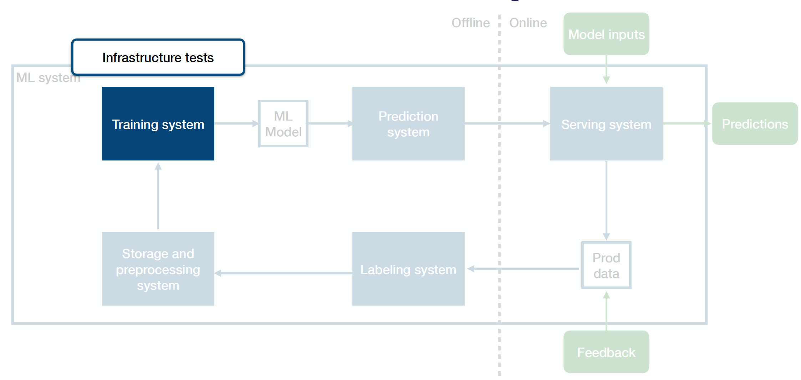

Hình 3.4 Kiểm tra cơ sở hạ tầng

Kiểm tra cơ sở hạ tầng là các bài kiểm tra đơn vị cho hệ thống đào tạo. Chúng giúp tránh được lỗi trong quá trình đào tạo và có thể kiểm tra đơn vị mã đào tạo giống như bất kỳ mã nào khác. Một phương pháp phổ biến khác là thêm các bài kiểm tra single-batch hoặc single-epoch để kiểm tra hiệu suất sau khi chạy chương trình đào tạo rút gọn trên một tập dữ liệu nhỏ, giúp phát hiện các hồi quy rõ ràng đối với mã đào tạo.

#### 3.2.2 Kiểm tra đào tạo
 
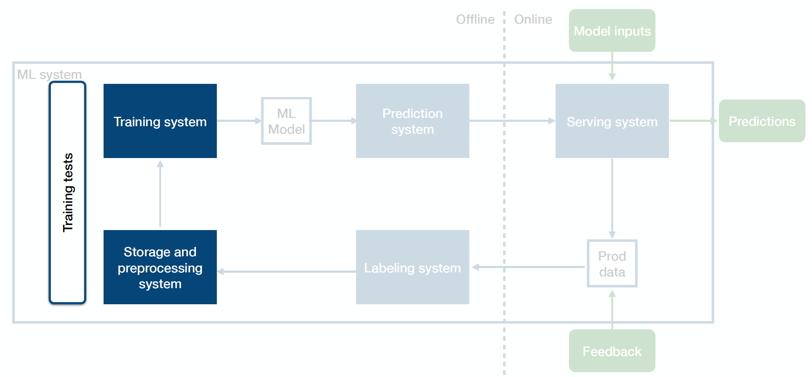

Hình 3.5 Kiểm tra đào tạo

Bài kiểm tra đào tạo là bài kiểm tra tích hợp giữa hệ thống dữ liệu và hệ thống đào tạo. Để đảm bảo rằng công việc đào tạo có thể tái tạo được.

Có thể lấy một tập dữ liệu cố định và chạy một chương trình đào tạo đầy đủ hoặc rút gọn trên đó. Sau đó, kiểm tra và đảm bảo rằng hiệu suất của mô hình trên mô hình mới được đào tạo vẫn nhất quán với hiệu suất tham chiếu.

Một tùy chọn khác là kéo một cửa sổ dữ liệu trượt (có thể là một cửa sổ mới cho vài ngày một lần) và chạy các bài kiểm tra huấn luyện trên cửa sổ đó.

#### 3.2.3 Kiểm tra chức năng
 
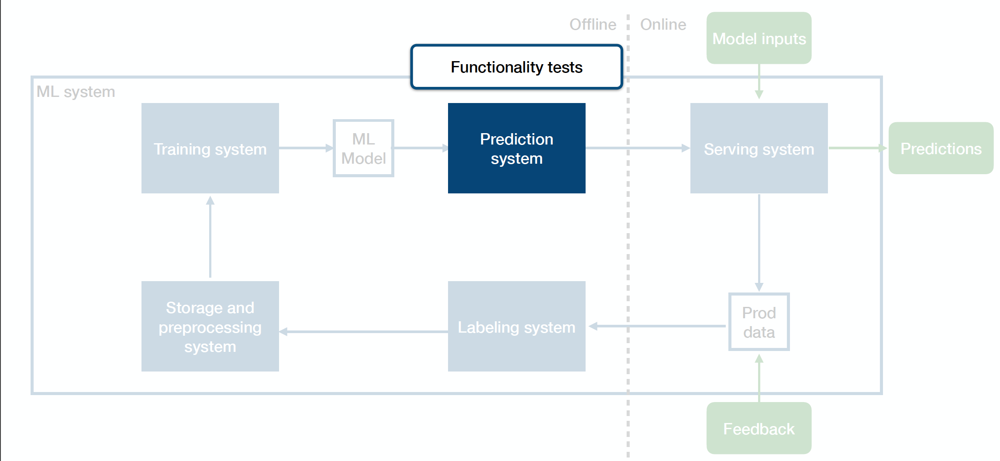

Hình 3.6 Kiểm tra chức năng

Kiểm tra chức năng là kiểm tra đơn vị cho hệ thống dự đoán. Chúng giúp tránh hiện tượng hồi quy trong mã tạo nên cơ sở hạ tầng dự đoán.

•	Có thể kiểm tra đơn vị mã dự đoán giống như bất kỳ mã nào khác.

•	Cụ thể đối với hệ thống ML, có thể tải mô hình được đào tạo trước và kiểm tra dự đoán của nó trên một số ví dụ chính.

#### 3.2.4 Kiểm tra đánh giá
 
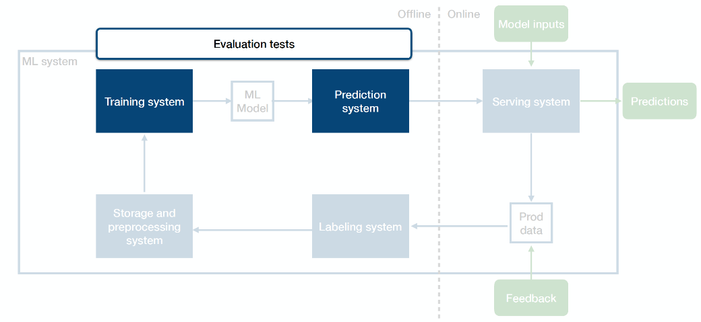

Hình 3.7 Kiểm tra đánh giá

Kiểm tra đánh giá là kiểm tra tích hợp giữa hệ thống đào tạo và hệ thống dự đoán. Đảm bảo rằng một mô hình mới được đào tạo đã sẵn sàng để đưa vào sản xuất. Những điều này tạo nên phần lớn những điểm độc đáo khi thử nghiệm hệ thống ML.

#### 3.2.5 Kiểm tra Shadow
 

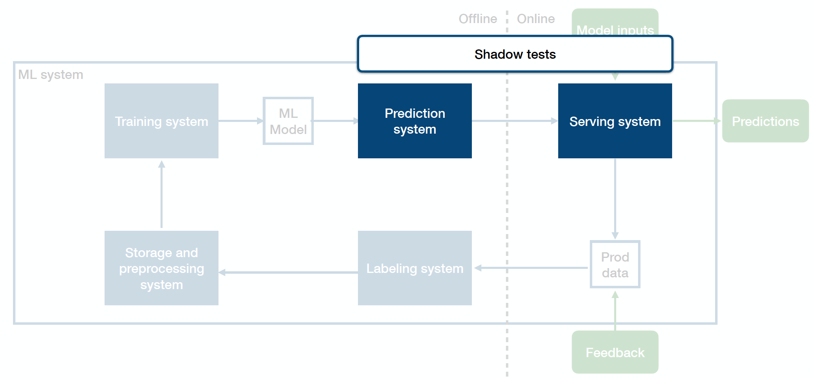

Hình 3.8 Kiểm tra Shadow

Kiểm tra shadow là kiểm tra tích hợp giữa hệ thống dự đoán và hệ thống phân phố. Chúng giúp phát hiện lỗi sản xuất trước khi lỗi đó gặp người dùng. Trong nhiều cài đặt, các mô hình (được xây dựng trong các khung như sklearn, Pytorch, TensorFlow, …) được phát triển tách biệt với hệ thống phần mềm hiện có. Ví dụ: mô hình gắn cờ các tweet không phù hợp có thể được phát triển trong TensorFlow trên một tập dữ liệu tĩnh chứ không phải trực tiếp trong môi trường phát trực tuyến của kiến trúc phần mềm rộng hơn. Do hệ thống dự đoán và hệ thống cung cấp được phát triển ở các cài đặt khác nhau với các giả định và môi trường khác nhau nên có nhiều cơ hội để lỗi xâm nhập. Những lỗi này có thể khó phát hiện trước khi tích hợp, vì vậy, thử nghiệm shadow có thể giúp xác định chúng trước.

#### 3.2.6 Thử nghiệm A/B
 
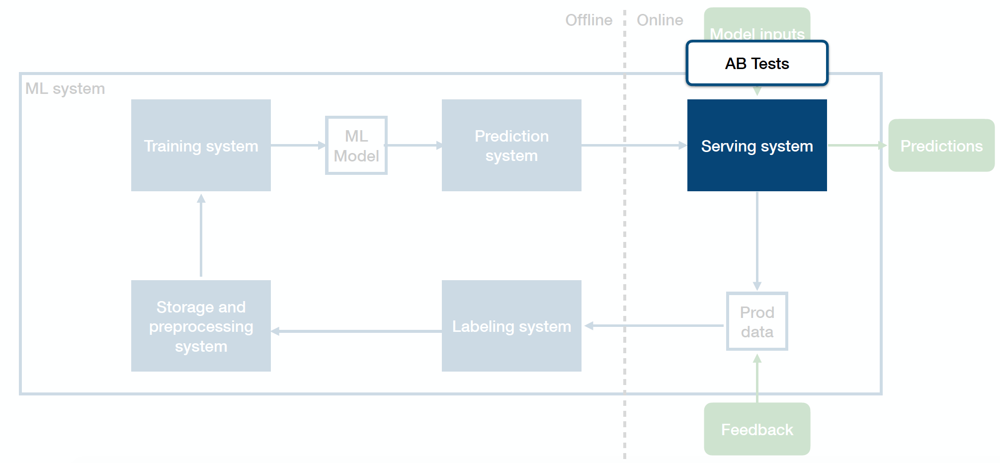

Hình 3.9 Thử nghiệm A/B

Kiểm tra shadow đánh giá hiệu suất dự đoán của mô hình như một phần của kiến trúc phần mềm rộng hơn nhưng không ảnh hưởng đến người dùng. Thử nghiệm A/B đảm nhận vai trò này. Thử nghiệm A/B là một phương pháp phổ biến trong công nghệ phần mềm, đặc biệt là trong các hệ thống web. Thử nghiệm A/B được định nghĩa là “một quá trình thử nghiệm ngẫu nhiên trong đó hai hoặc nhiều phiên bản của một biến (trang web, thành phần trang, ...) được hiển thị cho các phân khúc khách truy cập trang web khác nhau cùng lúc để xác định phiên bản nào để lại tác động tối đa và thúc đẩy các chỉ số kinh doanh.

#### 3.2.7 Kiểm tra ghi nhãn
 
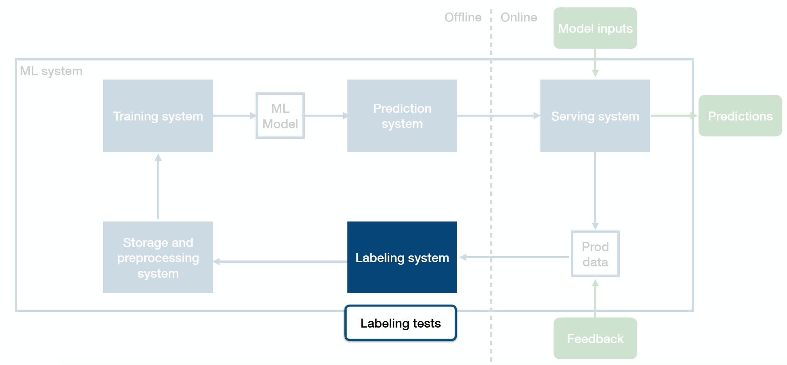

Hình 3.10 Kiểm tra ghi nhãn

Các mô hình học máy hoạt động theo mô hình GIGO: garbage in, garbage out. Để ngăn các nhãn chất lượng kém bị cắt xén và làm hỏng mô hình, cần kiểm tra đơn vị các hệ thống và quy trình ghi nhãn.

#### 3.2.8 Kiểm tra kỳ vọng
 
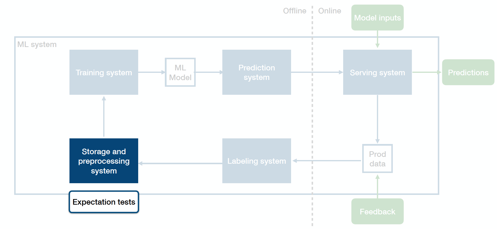

Hình 3.11 Kiểm tra kỳ vọng

Kiểm tra kỳ vọng giải quyết hệ thống lưu trữ và tiền xử lý dữ liệu. Về cơ bản, chúng là các bài kiểm tra đơn vị cho dữ liệu. Chúng được thiết kế để phát hiện các vấn đề về chất lượng dữ liệu và dữ liệu xấu trước khi chúng được đưa vào hệ thống.


## TÀI LIỆU THAM KHẢO
### Tiếng Việt
1.	Machine Learning cơ bản, Bài 7: Gradient Descent (phần 1/2), machinelearningcoban.com
https://machinelearningcoban.com/2017/01/12/gradientdescent/ 
2.	Machine Learning cơ bản, Bài 8: Gradient Descent (phần 2/2), machinelearningcoban.com
https://machinelearningcoban.com/2017/01/16/gradientdescent2/ 
3.	Vĩnh Anh Nghiêm Quân – Nguyễn Lê Trung Thành – Nguyễn Thị Lan Anh, ĐÁNH GIÁ HIỆU NĂNG CỦA CÁC THUẬT TOÁN TỐI ƯU TRONG MÔ HÌNH HỌC SÂU ĐỐI VỚI BÀI TOÁN PHÂN LỚP HÌNH ẢNH, Khoa Tin học – Trường ĐHSP Huế.
https://csdlkhoahoc.hueuni.edu.vn/data/2021/5/BaiDangHoiThao.pdf 
4.	Vương Quang Phước, Nguyễn Đức Nhật Quang, ĐÁNH GIÁ CÁC THUẬT TOÁN TỐI ƯU ĐỐI VỚI MÔ HÌNH MẠNG NƠ-RON TÍCH CHẬP TRONG TÁC VỤ NHẬN DIỆN HÌNH ẢNH, Khoa Điện, Điện tử và Công nghệ vật liệu, Trường Đại học Khoa học, Đại học Huế.
https://jos.husc.edu.vn/backup/upload/vol_18/no_1/668_fulltext_4.%C4%90TVT%20-%20Phuoc%20-%20Vuong%20Quang%20Phuoc.pdf 
5.	Trần Trung Trực, Optimizer- Hiểu sâu về các thuật toán tối ưu ( GD,SGD,Adam,..), viblo.asia.
https://viblo.asia/p/optimizer-hieu-sau-ve-cac-thuat-toan-toi-uu-gdsgdadam-Qbq5QQ9E5D8 


### Tiếng Anh
6.	Zeiler, M. D. (2012), Adadelta: an adaptive learning rate method, arXiv preprint arXiv:1212.5701.
7.	Reddi, S. J., Kale, S., & Kumar, S. (2019). On the convergence of adam and beyond. arXiv preprint arXiv:1904.09237.
8.	Continual Learning, paperswithcode.com.
https://paperswithcode.com/task/continual-learning 
9.	Z. Chen and B. Liu, 2018, Lifelong Machine Learning, C H A P T E R 4 Continual Learning and Catastrophic Forgetting.
https://www.cs.uic.edu/~liub/lifelong-learning/continual-learning.pdf 
10.	Neri Van Otten (Oct 3, 2023), Continual Learning Made Simple, How To Get Started & Top 4 Models, https://spotintelligence.com.
https://spotintelligence.com/2023/10/03/continual-learning/#Top_4_continual_learning_algorithms 


